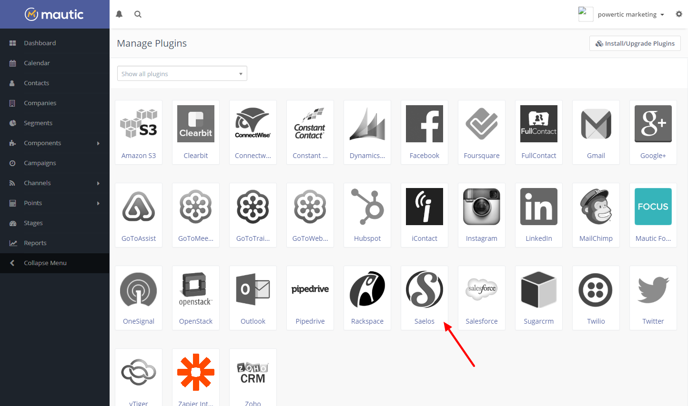
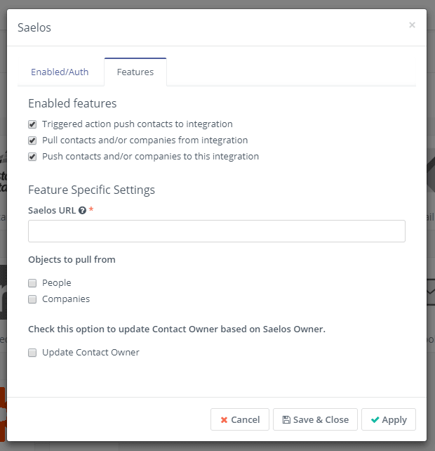

# Mautic Saelos Bundle

This integration pull and push contacts, companies and owners between Mautic and Saelos.

## Installation

### Before start

Verify if you have `composer.json` on your Mautic root install directory. If you don't found this file you need to get the latest version from github just running this command:

`wget -O https://github.com/mautic/mautic/raw/master/composer.json`

After verify composer.json, install Saelos plugin running:

`composer require mautic/mautic-saelos-bundle`

## Usage

Go to Mautic / Settings / Plugins and find Saelos Plugin:



Now you need to configure Saelos Plugin following the screen instructions:




After fill the options choose Save & Close.

## Server Setup

Setup a cron to run your sync on 5-10 min intervals:
```
*/5 * * * * /usr/bin/env php /var/www/html/app/console p:i:s Saelos > /dev/null 2>&1
```
